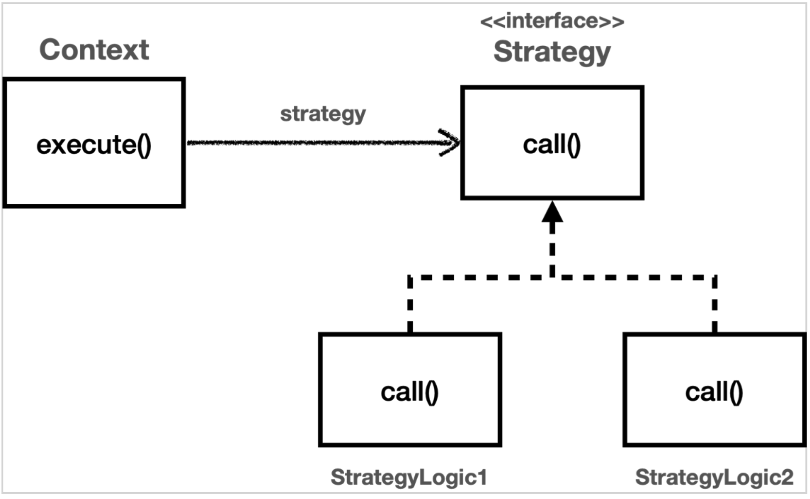
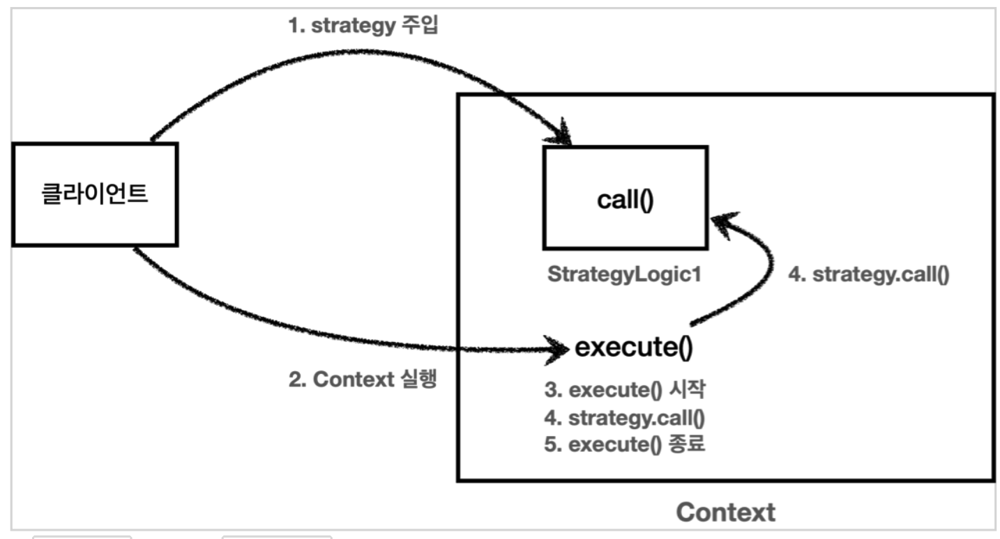

# 스프링 핵심 원리 - 고급편
인프런 김영한님의 [스프링 핵심 원리 - 고급편](https://www.inflearn.com/course/%EC%8A%A4%ED%94%84%EB%A7%81-%ED%95%B5%EC%8B%AC-%EC%9B%90%EB%A6%AC-%EA%B3%A0%EA%B8%89%ED%8E%B8) 강의를 공부하고 정리하는 페이지입니다.

[강의 소스코드](https://github.com/leesh5000/Spring-Practice/tree/master/%EC%8A%A4%ED%94%84%EB%A7%81%20%ED%95%B5%EC%8B%AC%20%EC%9B%90%EB%A6%AC%20%EA%B3%A0%EA%B8%89%ED%8E%B8/advanced)는 유료 강의이기 때문에 Private 저장소에 저장합니다.

## 1. 예제 만들기

- 요구사항은 모두 만족했지만, TraceId를 매소드의 파라미터로 넘기는 것은 변경 사항에 유연하게 대응할 수 없다. -> 다른 대안이 필요


## 2. ThreadLocal

- traceIdHolder 필드를 사용하는 것은 동시성 문제를 발생시킬 수 있다. (fieldLogTrace가 싱글톤으로 등록되었기 때문에)
- `2022-05-03 23:41:22.071  INFO 96432 --- [nio-8080-exec-5] h.advanced.trace.logtrace.FieldLogTrace  : [62ad053b] |-->OrderServiceV1.orderItem()` 톰캣에서 제공하는 thread ID `[nio-8080-exec-5]`

### 2.4. 동시성 문제 - 예제 코드
- 공유 자원에 대한 동시 접근으로 생기는 문제에 대해 알아봅시다.
- 싱글톤 객체의 필드에 접근할 떄 주의
- 지역변수에서는 동시성 문제가 발생하지 않는다. 왜냐하면, 쓰레드 마다 지역변수에서는 각가 다른 메모리 영역이 할당되기 때문이다.
- 싱글톤 객체의 멤버변수, static과 같은 공용 필드와 같은 곳에서 동시성 문제가 발생한다.

따라서, 이와같이 싱글톤 객체의 필드를 사용하면서 동시성 문제를 해결하기 위해서 사용하는 것이 `ThreadLocal`이다.

### 2.5. ThreadLocal - 소개
- ThreadLocal은 각 쓰레드마다 별도의 내부 저장소를 가지는 저장소 - 동시성 문제 해결
- 주의! 해당 쓰레드가 쓰레드 로컬을 모두 사용하고 나면, `ThreadLocal.remove()`를 호출해서 쓰레드 로컬에 저장된 값을 제거해 주어야한다. 제거를 하지 않으면 메모리 누수 발생 가능성
- `ThreadLocal.remove()`는 모든 ThreadLocal을 제거하는 것은 아니고, 해당 쓰레드의 전용 보관소만 제거

### 2.6. ThreadLocal - 예제 코드

### 2.7. 쓰레드 로컬 동기화 - 개발

### 2.8. 쓰레드 로컬 동기화 - 적용

### 2.9. 쓰레드 로컬 - 주의사항
- 쓰레드 로컬의 값을 사용 후 제거하지 않으면, WAS처럼 쓰레드 풀을 사용하는 경우 심각한 문제가 발생할 수 있음
- WAS는 사용이 끝난 쓰레드를 제거하지는 않고, 쓰레드 풀에 보관하여 재사용한다. (쓰레드 생성 비용은 비싸기 때문에)
- 중요한 점은, 이 때 쓰레드 로컬에 있는 쓰레드A의 데이터도 함께 살아있다는 것이다. (쓰레드 A를 제거하지 않았기 때문에)
- 이 때, 사용자B의 요청이 왔을 때, WAS가 쓰레드A를 꺼내고, 이 쓰레드A가 쓰레드 로컬에서 정보를 조회하면 이 때 사용자A의 데이터가 사용자B에게 전달된다.

따라서, 이런 문제를 예방하려면 반드시 쓰레드 로컬의 값을 다 썼으면 제거를 해주어야한다.

## 3. 템플릿 메서드 패턴과 콜백 패턴

### 3.1. 템플릿 메서드 패턴 - 시작
- 로그 추적기를 도입하려고 하니, 비즈니스 로직의 핵심 기능보다 로그를 찍는 부가 기능이 더 많아지는 문제가 생긴다.
- **핵심 기능**은 해당 메서드의 핵심 비즈니스 로직이며, **부가 기능**은 핵심 기능을 보조하기 위해 제공되는 기능으로, 로그 추적, 트랜잭션 기능 등이 있다.

#### 좋은 설계에 대해서
- 좋은 설계란, 변하는 것(핵심 로직)과 변하지 않는 것(부가 기능)을 잘 분리하는 것이다.
- 템플릿 메서드 패턴은 이런 문제를 해결하는 디자인 패턴이다.

### 3.2. 템플릿 메서드 패턴 - 예제1
- 변하는 부분과 변하지 않는 부분이 섞인 테스트 코드
- 템플릿 메서드 패턴을 사용하면, 변하는 부분과 변하지 않는 부분을 분리해서 모듈화 가능

### 3.3. 템플릿 메서드 패턴 - 예제2
- 템플릿 메서드 패턴은 부모 클래스에 변하지 않는 템플릿 코드를 만들고, 자식 클래스에서 변하는 부분을 상속과 오버라이딩을 사용해서 구현한다.
- 템플릿 메서드 패턴을 활용하면 코드 중복을 제거할 수 있다.
- 템플릿 메서드 패턴은 OCP 원칙을 보장한다.

### 3.4. 템플릿 메서드 패턴 - 예제3
- 템플릿 메서드 패턴은 자식 클래스를 계속 만들어줘야한다는 단점이 있다. -> 익명 내부 클래스를 사용하면 해결 가능 (클래스 파일을 만들지 않아도 됨)

### 3.5. 템플릿 메서드 패턴 - 적용1
-  제너릭 : 타입에 대한 정보를 객체 생성 시점으로 미룬다.
-  익명 내부 클래스를 활용하면, 별도의 자식 클래스 파일을 만들지 않아도 된다.
-  제네릭에서 반환 타입이 없을 때는 Void 사용

### 3.6. 템플릿 메서드 패턴 - 적용2
- 비교
  - OrderServiceV0 : 핵심 기능만 있다.
  - OrderServiceV3 : 핵심 기능과 부가 기능이 함께 섞여있음
  - OrderServiceV4 : 핵심 기능과 템플릿을 호출하는 코드가 섞여있음
- 좋은 설계란, 변경이 일어날 때 자연스럽게 드러난다.
- 예를들어, 로그 남기는 로직을 변경한다고 하면, AbstractTemplate만 변경하면 된다.

#### 단일 책임 원칙
- V4는 단일책임 원칙을 지킨다.
- 변경에 유연하게 대처할 수 있음

### 3.7. 템플릿 메서드 패턴 - 정의
- "작업에서 알고리즘의 골격을 정의하고 일부 단계를 하위 클래스로 연기합니다. 템플릿 메서드를 사용하면 하위 클래스가 알고리즘의 구조를 변경하지 않고도 알고리즘의 특정 단게를 재정의 할 수 있습니다." - GOF
- 부모클래스에 알고리즘의 골격 정의, 변경되는 로직은 하위 클래스에서 정의. 즉, 상속과 오버라이딩을 통한 다형성으로 문제를 해결하는 것
- 하지만, 템플릿 메서드 패턴은 자식 클래스와 부모 클래스가 강하게 결합되는 문제가 있다.
  - 자식 클래스는 부모 클래스의 기능을 전혀 사용하지 않지만, 템플릿 메서드 패턴을 위해서 부모 클래스를 상속받고 있다. 이것은 좋은 설계가 아니다.
  - 이러한 문제를 해결하기 위해서는 템플릿 메서드 패턴과 비슷한 역할을 하면서 상속의 단점을 제거할 수 있는 디자인 패턴이 바로 `전략 패턴(Strategy Pattern)`이다. :: **"상속보다 위임"** 

### 3.8. 전략 패턴 - 시작
- 템플릿 메서드 패턴보다 더 자주사용되고 더 좋은 전략 패턴

### 3.9. 전략 패턴 - 예제1



- 템플릿 메서드 패턴은 부모 클래스에서 변하지 않는 템플릿, 자식 클래스에서 변하는 부분을 두어 상속을 사용해서 문제 해결 -> 자식 클래스가 굳이 부모 클래스의 기능을 사용하지 않는데도, 의존 관계가 맺어지는 문제 발생
- 전략 패턴은 변하지 않는 부분을 `Context`에 두고, 변하는 부분을 `Strategy`라는 인터페이스를 만들고 해당 인터페이스를 구현하도록 하여 문제 해결 -> 상속이 아니라 위임으로 문제 해결
- 전략 패턴의 의도 : 알고리즘 제품 군을 정의하고, 각각을 캡슐화 하여 상호 교환 가능하게 만들자.
- 전략 패턴의 핵심은 `Context`는 Strategy 인터페이스에만 의존한다는 것이다. 따라서, Strategy의 구현체를 변경하거나 새로 만들어도 Context 에는 영향을 주지 않는다. -> 다른 전략을 쓰고자 구현체를 변경한다해도 `Context`는 변경할 필요가 없다.
- 스프링의 의존관계 주입 시 사용하는 것이 바로 이 전략패턴이다.

#### 전략 패턴 실행 그림



1. Context에 원하는 Strategy 구현체를 주입한다.
2. 클라이언트는 Context를 실행한다.
3. Context 로직 중간에 strategy.call()을 호출하여 주입받은 strategy 로직을 실행한다.
4. context는 나머지 로직을 실행한다.

#### 템플릿 메서드 패턴과의 비교 - "상속보다는 위임"

- 템플릿 메서드 패턴은 부모 클래스가 변경되는 경우 자식 클래스도 모두 영향이 간다.
- 전략 패턴은 인터페이스를 구현하였기 때문에, 영향을 받지 않고 단단하게 흘러갈 수 있다.

### 3.10. 전략 패턴 - 예제2

- 익명 내부 클래스를 자바8부터 람다로 변경할 수 있다. 단, 람다로 변경하렴녀 인터페이스 내에 매서드가 하나만 있어야 한다.
- "선 조립, 후 실행"
```java
void strategyV4() {
    ContextV1 context1 = new ContextV1(() -> log.info("비즈니스 로직1 실행"));
    context1.execute();
    ContextV1 context2 = new ContextV1(() -> log.info("비즈니스 로직2 실행"));
    context2.execute();
}
```
  - 이 방식은 미리 조립을 하고 나중에 실행하는 방식이다.
  - 이 방식의 장점은 조립이 끝나고 나면, 실행만 하면 된다. (조립에 대해서 더 이상 고민하지 않아도 됨)
  - 이 방식의 단점은 `Context`와 `Strategy`를 조립한 이후에는 전략을 변경하기가 어렵다는 점이다. 즉, 전략을 실시간으로 변경해야 하면 차라리 Context를 새로 하나 더 만드는 게 낫다.

### 3.11. 전략 패턴 - 예제3

- 이번에는, Context 생성 시점이 아니라 execute 실행 시점에서 strategy를 파라미터로 전달한다.
- 장점
  - 원하는 전략을 더욱 유연하게 변경 가능
  - 하나의 Context만 생성하면 됨
- 단점
  - 실행할때마다 전략을 계속 지정해주어야 함

#### 디자인 패턴

- 디자인 패턴은 패턴도 중요하지만, 무엇보다 패턴의 의도가 중요하다.

### 3.12. 템플릿 콜백 패턴 - 시작

- 앞서 봤던, Strategy 처럼 다른 코드의 인수로서 넘겨주는 실행 가능한 코드를 콜백이라고 한다.

#### 콜백 이란?

- 콜백 함수는 다른 코드의 인수로서 넘겨주는 실행 가능한 코드를 말한다.
- 자바 언어에서의 콜백은 주로 람다를 사용해서 콜백 처리한다.
- 자바8 이전에는 인터페이스 + 익명 내부 클래스 사용

#### 템플릿 콜백 패턴

- ContextV2와 같은 전략 패턴을 템플릿 콜백 패턴이라고 한다.
- 템플릿 콜백 패턴은 GOF 패턴은 아니고, 전략 패턴에서 템플릿 + 콜백이 강조된 패턴이다.
- 스프링에서는 JdbcTemplate, TransactionTemplate, RedisTemplate 처럼 다양한 템플릿 콜백 패턴이 사용된다. 스프링에서 xxxTemplate가 있다면 템플릿 콜백 패턴으로 만들어져 있다고 생각하면 된다.

### 3.13. 템플릿 콜백 패턴 - 예제

- context -> template
- strategy -> callback

### 3.14. 템플릿 콜백 패턴 - 적용

- `TraceTemplate`를 빈으로 등록해서 사용해도 됨, 다만 이렇게 하면 테스트 시 불편함이 있음

### 3.15. 정리

- 변하는 코드와 변하지 않는 코드를 분리
- 하지만, 템플릿 콜백 패턴도 한계가 있는데 그것은 아무리 최적화를 해도 어쨌든 원본 코드를 수정해야 한다는 한계점이 있다. 이것은 클래스가 수백 수천개 되었을때 결국 클래스 파일을 모두 수정해야하는 것은 마찬가지이다. 즉, 매소드 안에 핵심로직"만" 있는 것은 아니다.
- 다음 시간에는 원본 코드를 전혀 손대지 않고, 로그 추적기를 수정할 수 있는 방법을 알아본다. 그에 앞서, 프록시에 대한 개념을 알아본다.
- 스프링의 모든 "xxxTemplate"를 보면, 이번 강의를 떠올리면 된다.

## 4. 프록시 패턴과 데코레이터 패턴

### 4.1. 프로젝트 생성

### 4.2. 예제 프로젝트 만들기 v1

1. v1 : 인터페이스와 구현 클래스 - 스프링 빈으로 수동 등록
2. v2 : 인터페이스 없는 구체 클래스 - 스프링 빈으로 수동 등록
3. v3 : 컴포넌트 스캔으로 스프링 빈 자동 등록

- 프록시 기술은 실무에서 위의 세 가지 상황에서 모두 쓰이기 때문에 세 가지 상황을 모두 알아놓는다.

#### v1 : 인터페이스와 구현 클래스 - 스프링 빈으로 수동 등록

- 스프링은 @Controller 또는 @RequestMapping 이 있어야 스프링 컨트롤러로 인식
- @Import : 클래스를 스프링 빈으로 등록한다. 일반적으로 @Configuration 같은 설정 파일을 등록할 때 사용하지만, 스프링 빈을 등록할 때도 사용할 수 있다. scanBasePackages 등이 있을 때 강제로 빈을 주입해줄때 사용하면 유용하다.

### 4.3. 예제 프로젝트 만들기 v2

#### v2 : 인터페이스 없는 구체 클래스 - 스프링 빈으로 수동 등록

- 이번에는 인터페이스가 없는 controller, service, repository 를 스프링 빈으로 수동 등록해보자.
- @Controller는 자동으로 컴포넌트 스캔을 하기 때문에, @RequestMapping을 사용한다.

### 4.4. 예제 프로젝트 만들기 v3

#### v3 : 컴포넌트 스캔으로 스프링 빈 자동 등록

- 컴포넌트 스캔을 활용하여 등록

### 4.5. 요구사항 추가

- 이전까지의 문제점은 요구사항을 위해 기존 코드를 수정해야 한다는 단점이 있다.
- 원본 코드를 전혀 수정하지 않고, 로그 추적기를 적용하는 방법 -> 이 문제를 해결하려면, 프록시 개념을 이해해야한다.

### 4.6. 프록시, 프록시 패턴, 데코레이터 패턴 - 소개

- 클라이언트가 서버에 직접 요청하지 않고, **대리자(Proxy)**를 통해서 간접적으로 요청하는 경우
- 직접 요청을 하지 않고, 프록시를 통해 간접 요청하면 재밌는 일을 할 수가 있다.
  - 접근 제어, 캐싱
  - 부가 기능 추가
  - 프록시 체인 (클라이언트는 중간 과정을 알지 못함)
- **대체 기능**
  - 서버와 프록시는 같은 인터페이스를 사용해야 하며, 서버 객체를 프록시 객체로 변경해도 클라이언트 코드를 변경하지 않고 동작해야 한다.
- **프록시가 할 수 있는 기능, 크게 2가지**
  - 접근 제어
    - 권한에 따른 접근 차단
    - 캐싱(접근을 차단)
    - 지연 로딩
  - 부가 기능 추가
    - 원래 서버가 제공하는 기능에 더해 추가적인 기능을 수행할 수 있다.
    - 예) 요청 값이나, 응답 값을 중간에 변형
    - 예) 실행 시간을 측정해서 추가 로그를 남긴다.
- GOF 디자인 패턴에서는 이 둘을 의도에 따라서 나눈다.
  - 프록시 패턴 : 접근 제어가 목적
  - 데코레이터 패턴 : 새로운 기능 추가가 목적
- 프록시는 클라-서버, 객체 등 어디서든 사용될 수 있다. 규모의 차이만 있을 뿐, 근본적인 역할은 접근제어와 부가기능 추가이다.

### 4.7. 프록시 패턴 - 예제 코드1

- 프록시 패턴은 접근 제어가 목적이다.

### 4.8. 프록시 패턴 - 예제 코드2

- 프록시가 실제 호출하는 대상을 `target`이라고 한다.

### 4.9. 데코레이터 패턴 - 예제 코드1

### 4.10. 데코레이터 패턴 - 예제 코드2

- 데코레이터 패턴 : 프록시로 부가 기능을 추가하는 것
  - 예) 요청, 응답 값을 중간에 변형
  - 예) 실행 시간을 측정해서 추가 로그 남기기

### 4.11. 데코레이터 패턴 - 예제 코드3

- 프록시는 체인 될 수 있다.
- 클라이언트는 코드를 전혀 변경하지 않고, 프록시만 추가해주면 부가 기능을 추가해 줄 수 있다.

### 4.12. 프록시 패턴과 데코레이터 패턴 정리

- 데코레이터 패턴은 중복이 존재한다.
  - 꾸며주는 역할을 하는 Decorator들은 스스로 존재할 수 없으며, 항상 꾸며줄 대상이 있어야 한다.
  - 항상 component를 호출해야한다.
- 따라서, Real Component 와 Decorator(추상 클래스)를 나눈다.

#### 프록시 패턴 vs 데코레이터 패턴

- 디자인 패턴에서 각각의 패턴을 구분하는 방법은 **패턴의 의도**이다.
- 프록시 패턴 : 다른 객체에 대한 **접근을 제어**하기 위한 대리자를 제공
- 데코레이터 패턴 : 객체에 **추가 책임(기능)을 동적으로 추가**하고, 기능 확장을 위한 유연한 대안 제공

#### 정리

- 프록시를 사용하고, 해당 프록시가 접근 제어가 목적이면 프록시 패턴, 새로운 기능을 추가하는 것이 목적이라면 데코레이터 패턴

### 4.13. 인터페이스 기반 프록시 - 적용

- 스프링 컨테이너에는 프록시 객체가 등록된다.
- 프록시 객체는 스프링 컨테이너에 올라가고, 자바 힙 메모리에도 올라간다. (프록시가 참조하는) 실제 객체는 자바 힙 메모리에는 올라가지만, 스프링 컨테이너가 관리하지는 않는다.
- **v1 : 인터페이스가 있는 구현 클래스에 프록시 적용** 완료
- 단점 : 너무 많은 프록시 클래스를 만들어야한다.

### 4.14. 구체 클래스 기반 프록시 - 예제1

- 인터페이스가 없어도 프록시를 도입할 수 있다.

### 4.15. 구체 클래스 기반 프록시 - 예제2

- 인터페이스가 없어도 다형성을 활용하여 프록시를 사용할 수 있다.
- 자바에서 다형성은 인터페이스, 클래스를 구분하지 않고 모두 적용된다.

### 4.16. 구체 클래스 기반 프록시 - 적용

- 클래스 기반 프록시의 단점 : `super(null)`로 부모 클래스의 생성자를 호출해야한다.
- 인터페이스 기반 프록시는 이런 고민을 하지 않아도 된다.

### 4.17. 인터페이스 기반 프록시와 클래스 기반 프록시

- 인터페이스 기반 프록시 vs 클래스 기반 프록시
  - 클래스 기반 프록시는 상속을 사용하기 때문에 몇 가지 제약이 있다.
    - 부모 클래스의 생성자 호출
    - 클래스, 매서드에 final 키워드가 붙으면 사용 불가
  - 인터페이스 기반 프록시가 더 좋다.
    - 인터페이스 기반 프록시는 캐스팅 관련해서 단점이 존재한다. (뒤에 나옴)
    - 다만, 인터페이스란 구현을 변경할 가능성이 존재할 때 활용하는 것이 좋다. 그렇지 않은 경우에 무작정 인터페이스를 사용하는 것은 번거로운 작업이다.
  - 실무에서는 인터페이스, 구체클래스 모두 사용하니까 둘 다 알고 있어야 한다.

#### 문제점 : 너무 많은 프록시 클래스

- 기존 코드를 변경하지 않고, 부가 기능을 추가해보았지만 프록시를 너무 많이 만들어야한다. 
- 프록시 클래스가 하는 일이 모두 같다면, 프록시 클래스를 하나만 만들어서 모든 곳에 적용할 수는 없을까?
  - 다음에 알아볼, 동적 프록시 기술을 사용하면 된다.

### 4.18. 정리

## 5. 동적 프록시 기술

### 5.1. 리플렉션

- 문제점 : 로그 추적을 위한 프록시 클래스들의 소스코드는 거의 같은 모양을 하고 있다.
- JDK 동적 프록시 기술이나 CGLIB 같은 프록시 생성 오픈소스 기술을 활용하면 프록시 객체를 동적으로 만들 수 있다.
- JDK 동적 프록시 기술을 이해하려면, 자바 리플렉션 기술을 알아야한다.
- 리플렉션은 클래스나 매서드의 메타정보를 사용해서 동적으로 호출하는 매서드를 변경할 수 있다.
- 주의할 점은, 리플렉션은 가급적 사용하면 안된다. 왜냐하면, 리플렉션은 런타임 시에 동작하므로 컴파일 시점에 오류를 잡을 수 없다.
- 리플렉션은 프레임워크 개발이나 매우 일반적인 공통 처리가 필요할 때 부분적으로 주의해서 사용하도록 하자

### 5.2. JDK 동적 프록시 - 소개

- 동적프록시 기술을 활용하면, 개발자가 직접 프록시를 만들지 않아도 되고, 런타임에 만들어준다.
- JDK 동적 프록시는 인터페이스를 기반으로 프록시를 동적으로 만들어주기 때문에 인터페이스가 필수이다.

### 5.3. JDK 동적 프록시 - 예제 코드

- InvocationHandler 구현
- 동적 프록시 하나에 InvocationHandler만 만들어서 넣어주면 되고, 부가 기능 또한 하나의 클래스에 모아 있기 때문에 SRP 원칙을 지킬 수 있다.

### 5.4. JDK 동적 프록시 - 적용1

- no-log도 로그를 남기는 문제가 존재

### 5.5. JDK 동적 프록시 - 적용2

- 